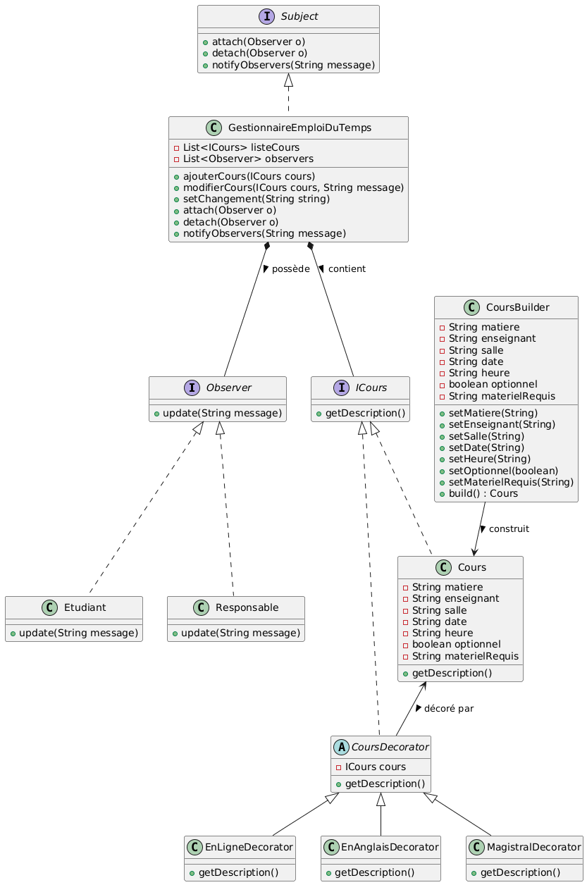

eleve :
CS (15)

✅ Ce que ton implémentation viole (court et précis)
1️⃣ Builder → viole le principe SRP (Responsabilité unique)

📍 Où :
Si ton CoursBuilder gère à la fois la construction et la validation ou la logique métier, il viole SRP.
Il doit uniquement construire l’objet.

2️⃣ Observer → viole le principe OCP (Ouvert/Fermé)

📍 Où :
Dans GestionnaireEmploiDuTemps, si tu dois modifier la classe pour ajouter un nouvel observer ou changer la logique de notification, tu violes OCP.
La classe ne devrait pas être modifiée pour chaque nouvel observer.

3️⃣ Decorator → peut violer le principe LSP (Substitution de Liskov)

📍 Où :
Si un décorateur (ex : EnLigneDecorator, MagistralDecorator) change le comportement du cours au lieu de simplement étendre la description, il ne peut plus remplacer un ICours correctement → violation du LSP.